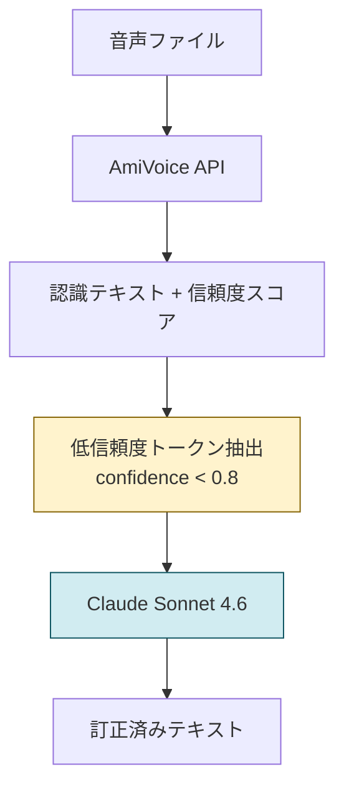

## はじめに

初投稿です！！！
Zennfes 2026の協賛企画でAmiVoice APIを使えるということで、既存APIとの比較と、後段LLMでの補正による効果について簡単な検証をしてみました。

音声認識（ASR）の出力には、同音異義語の取り違えや文の区切り誤りがつきものです。たとえば「レンガ**製**の倉庫」が「レンガ**制**の倉庫」になったり、「海にかかる**真っ直ぐ**な橋」が「海にかかり**ます。すぐ**な橋」になったりします。音としては合っているけれど、文脈を考えると明らかにおかしい。こうした誤りに対しては、LLMによる補正が有効なことが知られています。

今回は、AmiVoice APIとClaude Sonnetを組み合わせた訂正パイプラインを作り、Common Voice日本語テストデータ6,197件で検証しました。

## この記事でわかること

- ASRの認識結果に対するLLM後処理の具体的な設計と効果
- CERだけでは見えない「意味的な改善」の測り方
- うまくいくケースと失敗するケースの傾向

## AmiVoiceと他APIの比較

今回の企画でAmiVoice APIを使うことは決まっていたので、「選定」というほどのものではありませんが、他のAPIと比較してみました。

### コスト

主要ASR APIの料金比較です（2026年5月時点）。

| サービス | 1時間あたり料金 | 無料枠 | 課金単位 |
|---------|---------------|-------|---------|
| **AmiVoice**（汎用・非同期） | **79.2円** | 60分/月（恒久） | 1秒単位・発話区間のみ |
| GCP Speech-to-Text V2 | 約149円（$0.96） | 60分/月（恒久） | 15秒切り上げ |
| AWS Transcribe | 約223円（$1.44） | 60分/月（初年度のみ） | 1秒単位・15秒最低課金 |

発話区間のみの課金なので、無音が多い会議音声だと実質コストはさらに下がります。個人的には、AmiVoiceの良さの1つは、APIキーだけですぐ使い始められる手軽さだと思いました。

### 認識精度の実測

Common Voice v17.0日本語テストデータ（6,261件）を各APIに通した結果です。

| サービス | CER（文字誤り率） | WER（単語誤り率） |
|---------|-------------------|-------------------|
| AWS Transcribe | 12.98% | 14.87% |
| GCP Speech-to-Text | 17.66% | 19.73% |
| AmiVoice | 20.51% | 23.13% |

AmiVoiceのCERは20.51%で、精度だけ見ると他より劣ります。ただ、料金が最安なので「安いASR + LLM後処理」で高いASR単体に迫れるなら面白いな、と思いました。結果としてはLLM訂正後のCERは18.82%まで改善し、GCPの17.66%に近い水準になりました。

## パイプラインの設計

### 全体の流れ



### 低信頼度トークンの抽出

AmiVoiceのAPIレスポンスにはトークンごとの信頼度スコアが含まれています。信頼度が0.8を下回るトークンを抽出して、「ここが怪しい」というヒントとしてLLMに渡します。

```python
def load_amivoice_confidence(raw_path, threshold=0.8):
    with open(raw_path, encoding="utf-8") as f:
        data = json.load(f)
    tokens = []
    for result in data.get("results", []):
        for t in result.get("tokens", []):
            if t["confidence"] < threshold:
                tokens.append({"token": t["written"], "confidence": t["confidence"]})
    return tokens
```

たとえば「レンガ制の倉庫も海にかかります。すぐの橋も…」というASR結果だと、以下のトークンが抽出されます。

```json
[
  {"token": "光",     "confidence": 0.75},
  {"token": "制",     "confidence": 0.65},
  {"token": "倉庫",   "confidence": 0.72},
  {"token": "かかり", "confidence": 0.71},
  {"token": "すぐ",   "confidence": 0.69}
]
```

「制」のconfidenceは0.65で、実際に正解は「製」（レンガ**製**の倉庫）です。

### 訂正プロンプトの設計方針

LLMに渡すプロンプトでは**「迷ったら変更しない」**を基本方針にしました。過剰訂正は修正しないことより悪いので、訂正するのは次の3条件を全て満たす場合のみです。

1. 音声的に説明できる取り違えである（同音異義語、文の区切りずれ）
2. 正しい語が文脈から高い確信を持って特定できる
3. 修正により文全体の意味が改善される

使用モデルはClaude Sonnet 4.6、temperature=0です。

<!-- textlint-disable jtf-style/3.1.1.全角文字と半角文字の間 -->
:::details 訂正プロンプト（全文）

**System message**

```
あなたは日本語ASR誤り訂正システムです。入力されたASRテキストの誤認識を修正し、JSON形式で返してください。説明や思考は不要です。
```

**User message**

```xml
<task>
以下のASR（音声認識）結果テキストの誤認識を修正してください。
</task>

<asr_text>
{asr_text}
</asr_text>

<low_confidence_tokens>
{low_confidence_tokens_formatted}
</low_confidence_tokens>

<guidelines>
原則: 迷ったら変更しない。誤った修正は、修正しないことより悪い。

修正すべきもの（以下のすべてを満たす場合のみ）:
- 音声的に説明できる取り違えである（同音異義語、類音語、文の区切りずれ）
- 正しい語が文脈から高い確信をもって特定できる
- 修正により文全体の意味が改善される

修正してはいけないもの:
- 文法的に正しく意味が通る文（正解と異なっていても変更しない）
- 句読点の有無や位置の違い
- 表記スタイルの差（漢数字/アラビア数字、ひらがな/カタカナ、送り仮名等）
- 正しい語の候補が複数あり絞り込めない箇所
- 元テキストが大幅に崩壊しており正しい文を推測できない箇所

信頼度スコアは参考情報です。高信頼度(1.0)でも誤りの場合があり、
低信頼度でも正しい場合があります。
</guidelines>

<examples>
入力: "レンガ制の倉庫も海にかかります。すぐな橋も全てが瓦礫とかしていた"
低信頼度: [{"token": "制", "confidence": 0.82}, {"token": "ます", "confidence": 0.65},
           {"token": "か", "confidence": 0.70}]
出力: {"corrected_text": "レンガ製の倉庫も海にかかる真っ直ぐな橋も全てが瓦礫と化していた"}

入力: "疲労回復には十分な睡眠が必要だ。"
低信頼度: [{"token": "に", "confidence": 0.70}]
出力: {"corrected_text": "疲労回復には十分な睡眠が必要だ。"}
</examples>

JSON形式のみで出力: {"corrected_text": "修正後のテキスト"}
```

:::
<!-- textlint-enable jtf-style/3.1.1.全角文字と半角文字の間 -->

## 評価方法

### データ

Mozilla Common Voice v17.0の日本語テストデータ6,197件（AmiVoiceで正常に認識された音声）を使いました。

### CERとWER

<!-- textlint-disable ja-technical-writing/ja-no-mixed-period -->
:::details CER/WERの定義
<!-- textlint-enable ja-technical-writing/ja-no-mixed-period -->

**CER（文字誤り率）** は、正解テキストと認識テキストを文字単位で比較し、置換・挿入・削除の合計を正解文字数で割った値です。

$$
\text{CER} = \frac{S + I + D}{N}
$$

日本語は空白区切りがないため、文字単位のCERが主指標です。

**WER（単語誤り率）** は形態素解析器（SudachiPy, SplitMode.C）で分割した単語単位で同様に計算します。
:::

### CERの限界

CERは表層的な一致を測るので、意味を変えない差異もエラーになります。

<!-- textlint-disable jtf-style/4.1.1.句点(。) -->

- 「忘れた」vs「忘れた。」→ 句読点の有無だけ
- 「ふぇあ」vs「フェア」→ 同音のカナ表記差
- 「二十」vs「20」→ 同じ値の数字表記差

<!-- textlint-enable jtf-style/4.1.1.句点(。) -->

こういった差異を除外して本質的な認識品質を測るために、意味的な評価指標も導入しました。

### 意味的な評価指標

<!-- textlint-disable ja-technical-writing/ja-no-mixed-period -->
:::details 3つの意味的指標の詳細
<!-- textlint-enable ja-technical-writing/ja-no-mixed-period -->

#### LLM-CER（LASER方式）

LASER（LLM-based ASR Scoring and Evaluation Rubric、EMNLP 2025[^1]）に基づきます。正解テキストと評価対象の各差異を、意味的重要度で3段階に分類します。

| ペナルティ | 重み | 対象 |
|-----------|------|------|
| No-Penalty | 0.0 | 意味を変えない表記差（句読点、カナ差、数字表記差） |
| Minor-Penalty | 0.5 | 軽微な文法差（助詞の差で文意不変、活用形の差） |
| Major-Penalty | 1.0 | 意味を変える差異（同音異義語、否定の反転、内容語の欠落） |

<!-- textlint-disable ja-technical-writing/ja-no-mixed-period -->

$$
\text{LLM-CER} = \frac{\text{Major} \times 1.0 + \text{Minor} \times 0.5}{\text{正解文字数}}
$$

<!-- textlint-enable ja-technical-writing/ja-no-mixed-period -->

<!-- textlint-disable -->

#### Intent Score（意図保持スコア）

文の核心メッセージ（誰が・何を・どうした）が維持されているかを0/1で判定します。

#### Entity Preservation（エンティティ保持率）

固有名詞・数値・日付などの重要エンティティが正しく保持されている割合（0.0〜1.0）です。

<!-- textlint-enable -->

:::

3指標ともSarvam AIの手法[^2]に基づき、評価にはClaude Sonnet 4.6を使いました。

## 結果

### 定量比較

6,197件全件にLLM訂正を適用した結果です。

| 指標 | 訂正前 | 訂正後 | 改善率 |
|------|--------|--------|-----------|
| CER | 19.82% | 18.82% | -5.0% |
| WER | 28.65% | 25.35% | -11.5% |
| LLM-CER | 6.14% | 5.27% | **-14.1%** |
| Intent Score | 0.638 | 0.695 | +8.9% |
| Entity Preservation | 0.850 | 0.869 | +2.2% |

:::message
LLM-CERの改善率（-14.1%）がCERの改善率（-5.0%）の約3倍あります。LLMが句読点やカナ表記のような表層的な差異ではなく、同音異義語の修正や文区切りの修復など意味に影響する誤りを選択的に直していることがわかります。
:::

### 訂正の適用状況

6,197件中、LLMが訂正したのは2,028件（32.7%）。残り67.3%は「修正不要」と判断し、元テキストをそのまま返しました。

### 訂正がうまくいった例

いずれも訂正後のテキストが正解と完全一致しています。

**同音異義語の修正：「こうい」「じょうしき」**

| | テキスト |
|---|---------|
| ASR結果 | 常識は社会的経験の集積であって、我々の**好意**の多くは**非常識**に従って行われている。 |
| 訂正後 | 常識は社会的経験の集積であって、我々の**行為**の多くは**常識**に従って行われている。 |

前半で「常識は集積である」と言っているのに後半で「非常識に従う」では矛盾します。LLMがこの矛盾を捉えて修正しました。

**音の類似：「しゅうかく」→「すうがく」**

| | テキスト |
|---|---------|
| ASR結果 | **収穫**がなぜ好きかというと、ただ1つの答えが論理的にはっきりと出てくるからです。 |
| 訂正後 | **数学**がなぜ好きかというと、ただ1つの答えが論理的にはっきりと出てくるからです。 |

「論理的に答えが出る」という文脈から「収穫」ではなく「数学」だと判断されました。

**文脈からの推定：「かかく」→「かがく」**

| | テキスト |
|---|---------|
| ASR結果 | **価格**は技術の基礎であり、科学の発達が技術の発達を可能にする。 |
| 訂正後 | **科学**は技術の基礎であり、科学の発達が技術の発達を可能にする。 |

後半に「科学の発達が」と出てくるので、冒頭も「科学」であるべきだと判断されました。

### 失敗例と限界

6,197件中1,730件（28%）ではCERが悪化しました。

**パターン1：元の認識が壊れすぎている**

<!-- textlint-disable -->

| | テキスト |
|---|---------|
| 正解 | コーヒーよりも紅茶が好みだ |
| ASR結果 | 言える派な。コーヒー屋でも紅茶がコロイド。 |
| 訂正後 | いわゆる話な。コーヒー屋でも紅茶が頼めるよ。 |

<!-- textlint-enable -->

「言える派な」→「コーヒーよりも」は音の対応関係がほとんどなく、LLMが文脈から元の意味を復元できません。結果として、文法的には通るが意味の異なる別の文を生成してしまっています。

**パターン2：正しい認識結果を変えてしまう**

| | テキスト |
|---|---------|
| 正解 | 手相はいつか |
| ASR結果 | 手相はいつか。 |
| 訂正後 | **手術**はいつか。 |

ASRの認識は正しかった（句読点の差のみ）のに、LLMが「手相」を「手術」に変えてしまいました。短い文だと文脈が足りず、こういう誤判断が起きます。

:::message alert
悪化ケースの多くは「元のASRが既に正しい、またはほぼ正しい」ケースです。confidence平均が高い認識結果はLLMに渡さない、といったフィルタリングで改善できそうです。
:::

## まとめ

AmiVoice APIとClaude Sonnetを組み合わせた音声認識テキスト補正パイプラインを6,197件で検証しました。

- CERは5.0%改善（19.82%→18.82%）、意味的品質を測るLLM-CERは14.1%改善（6.14%→5.27%）
- 「迷ったら変更しない」方針で67.3%の認識結果は修正せず、過剰訂正を抑制
- 一方で28%のケースではCERが悪化。短文や固有名詞の多い音声では限界がある

会議録の自動生成など、多少の誤りは許容できるがコストを抑えたい場面で、安価なASRとLLM後処理の組み合わせは現実的な選択肢になりそうです。

本記事で使用したコードは以下のリポジトリで公開しています。

https://github.com/yuukis20000114/amivoice-api-llm

[^1]: Parulekar et al., "LASER: LLM-based ASR Scoring and Evaluation Rubric", EMNLP 2025 (arXiv:2510.07437)
[^2]: Sarvam AI, "LLM-WER" / "LLM Intent & Entity Evaluation", GitHub (https://github.com/sarvamai/llm_wer, https://github.com/sarvamai/llm_intent_entity)
